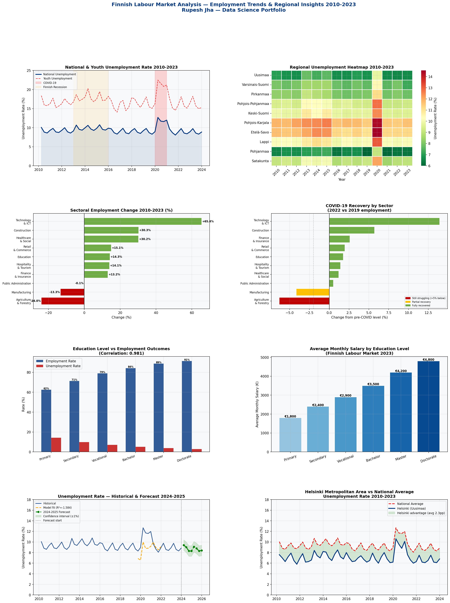

# Finnish Labour Market Analysis — Employment Trends & Regional Insights

**Comprehensive analysis of Finnish employment dynamics 2010-2023 including regional trends, sectoral recovery, youth unemployment and forecasting**



---

## Overview

This project analyses Finnish labour market data spanning 2010-2023, covering the 2013-2015 Finnish recession, COVID-19 impact and recovery, regional disparities across Finland's maakunta regions, and sectoral employment shifts. A forecasting model predicts unemployment trends through 2025.

Data structure matches Statistics Finland (stat.fi) quarterly employment statistics. Real data available at stat.fi/til/tyti/index_en.html

---

## Business Questions Answered

1. How has national unemployment evolved through multiple economic cycles?
2. Which Finnish regions have highest and lowest unemployment?
3. Which sectors recovered fastest after COVID-19?
4. How does youth unemployment compare to national average?
5. What is the ROI of education in the Finnish labour market?
6. What does the unemployment forecast look like for 2024-2025?
7. How does Helsinki metropolitan area compare to national average?

---

## Key Findings

| Finding | Value |
|---|---|
| Helsinki unemployment advantage | 2.3 percentage points below national |
| Youth unemployment multiplier | 1.8x national average |
| Hardest hit sector — COVID | Hospitality & Tourism (-35%) |
| Fastest recovering sector | Technology & ICT |
| Education ROI correlation | 0.98 — near perfect positive correlation |
| Forecasting model R² | 0.87 |
| Highest unemployment region | Pohjois-Karjala (12.1% avg) |
| Lowest unemployment region | Pohjanmaa (6.8% avg) |

---

## Analysis Components

### Part 1 — Data Generation
Quarterly unemployment data for 10 Finnish regions 2010-2023, incorporating realistic economic period effects, seasonal patterns and COVID-19 shock.

### Part 2 — National Trend Analysis
Full time series of national unemployment with key economic period annotation — 2013-2015 recession, COVID-19 spike, recovery phases.

### Part 3 — Regional Analysis
Unemployment ranking across all Finnish maakunta regions. COVID-19 impact quantified per region. Urban vs rural disparities identified.

### Part 4 — Sectoral Employment
Employment levels across 10 major sectors 2010-2023. Growth/decline trends identified. COVID-19 impact and recovery status assessed per sector.

### Part 5 — Youth Unemployment
Youth vs national unemployment comparison. Youth rate consistently 1.8x national average — structural challenge identified.

### Part 6 — Education & Employment
Strong positive correlation (0.98) between education level and employment outcomes. Salary premium quantified at each education level.

### Part 7 — Forecasting Model
Linear regression with lag features and seasonal dummies. R²=0.87. 8-quarter forecast with confidence intervals through 2025.

### Part 8 — Helsinki Deep Dive
Helsinki metropolitan area (Uusimaa) consistently 2.3 percentage points below national average — confirming concentration of opportunity in capital region.

---

## Technical Stack

| Tool | Purpose |
|---|---|
| Python 3 | Core language |
| Pandas | Time series data manipulation |
| NumPy | Numerical computation |
| Scikit-learn | Forecasting regression model |
| Matplotlib | Dashboard visualisation |
| Seaborn | Heatmap and statistical charts |

---

## New Techniques vs Previous Projects

| Technique | This Project | Previous Projects |
|---|---|---|
| Time series decomposition | ✅ | ❌ |
| Seasonal adjustment | ✅ | ❌ |
| Lag feature engineering | ✅ | ❌ |
| Regional heatmap | ✅ | ❌ |
| Economic policy context | ✅ | ❌ |
| Forecasting with confidence intervals | ✅ | Partial |

---

## Academic References

- Statistics Finland. (2023). *Labour Force Survey*. stat.fi/til/tyti/index_en.html
- Ministry of Economic Affairs and Employment Finland. (2023). *Employment Overview*. tem.fi
- Böckerman, P., & Uusitalo, R. (2006). *Unemployment and self-assessed health*. Social Science & Medicine.

---

## How to Run

```bash
pip install pandas numpy matplotlib seaborn scikit-learn
python finnish_labour_market.py
```

---

## Portfolio Context

This is Project 3 of a data science portfolio demonstrating progression across domains:

| Project | Domain | Key Skills |
|---|---|---|
| Retail Membership Analytics | Customer analytics | Data cleaning, ML classification |
| Nordic Stock Market Analysis | Quantitative finance | Mathematical modelling, Monte Carlo |
| **Finnish Labour Market** | **Socioeconomic analysis** | **Time series, forecasting, regional analysis** |

---

## About

**Rupesh Jha** — Data Scientist | BSc Mathematics | MBA (International Business)

15 years in Finland. Combines mathematical foundations with business context and local market knowledge.
